# SET

### When you first open the game you see a screen giving you the option to play either single or multiplayer:

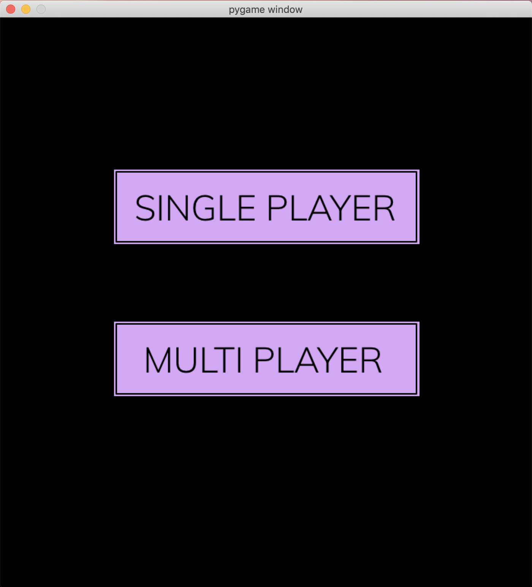

## If you click on single player you go to this screen:

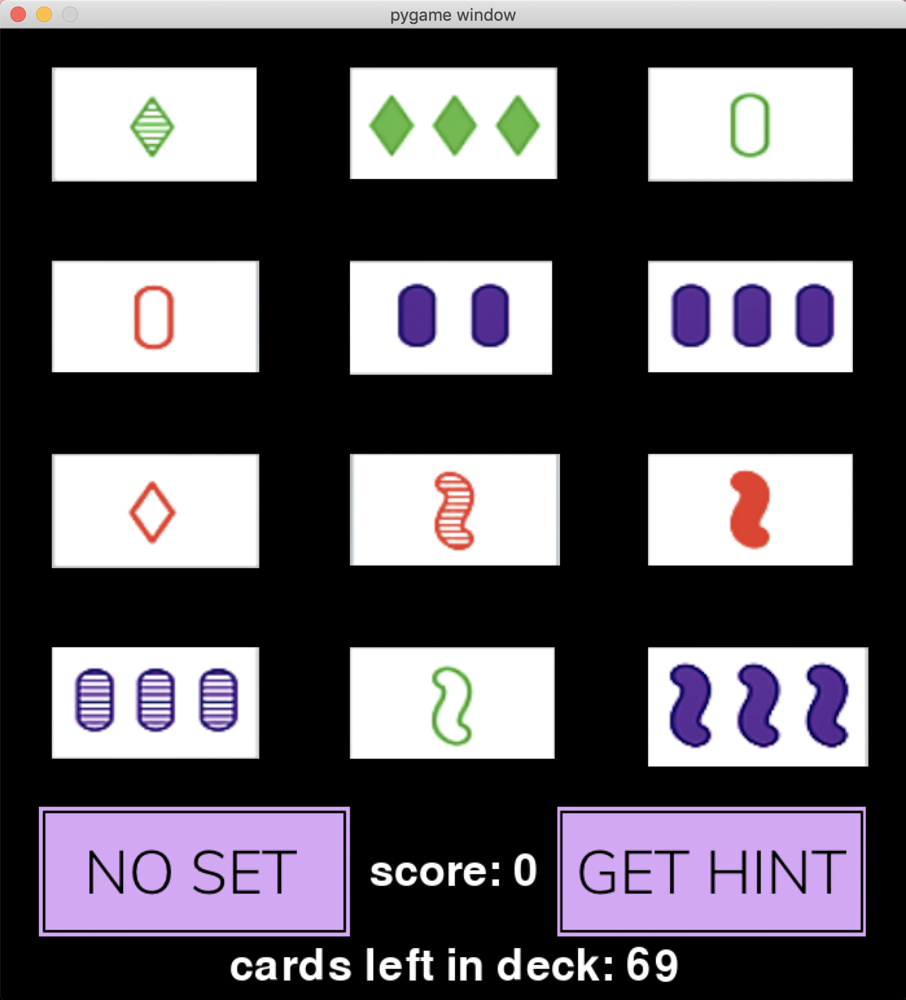

### You can click and unclick cards. Clicked cards have a yellow outline around them

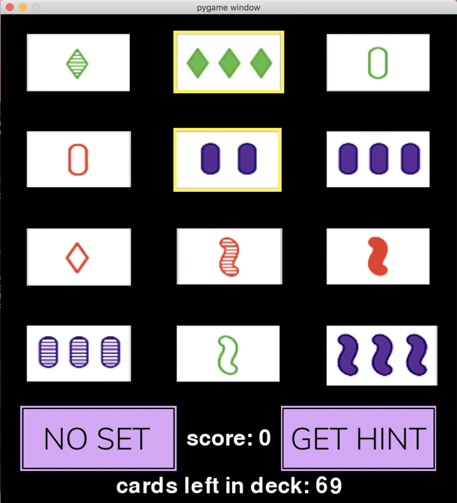
### Clicking the "get hint" button clicks a card in the set for you
### If there is no set, the "get hint" button doesn't do anything

### When you click 3 cards the game automatically checks if they make up a set or not
### If they make up a set, the three cards are replaced by 3 new cards from the deck, the deck size decreases, and your score increases by 1

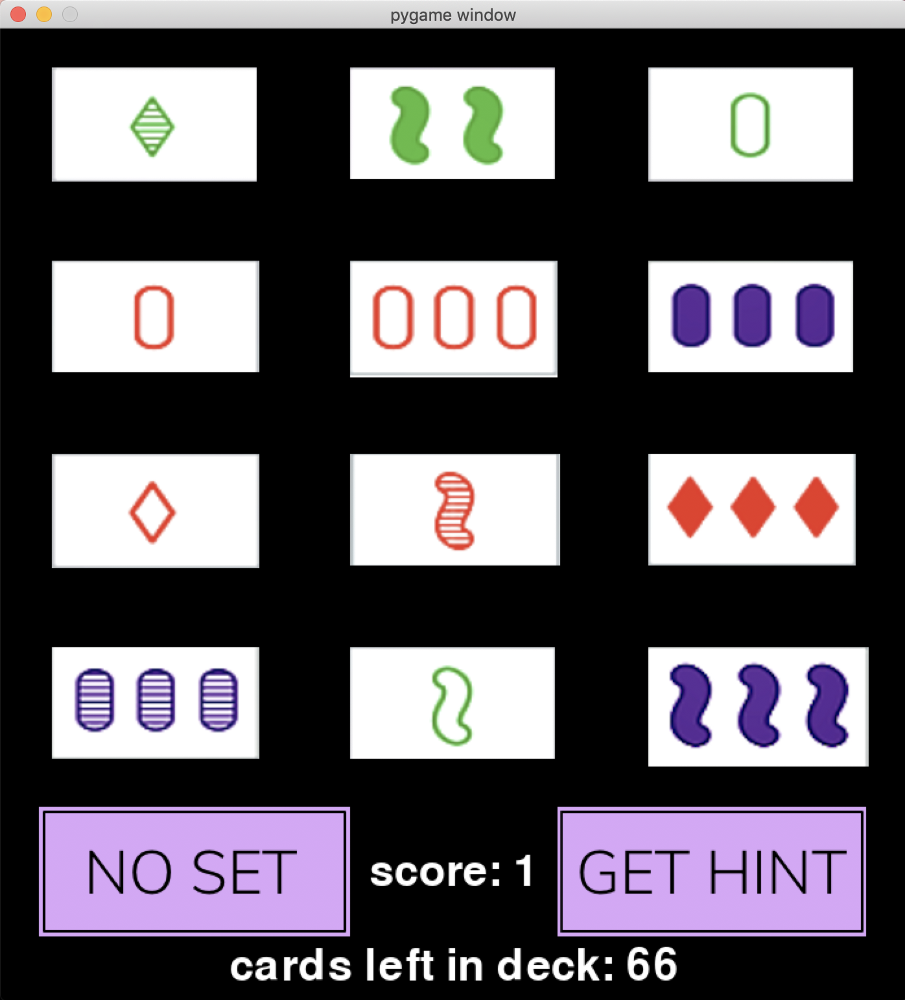

### If you think there is no set, you can click on the "no set" button
### If you are correct and there really is no set, all of the cards that are currently displayed get put back into the deck, the deck gets shuffled, and 12 random cards are displayed. If there is a set and you click "no set," nothing happens

### Situation in which there is no set:
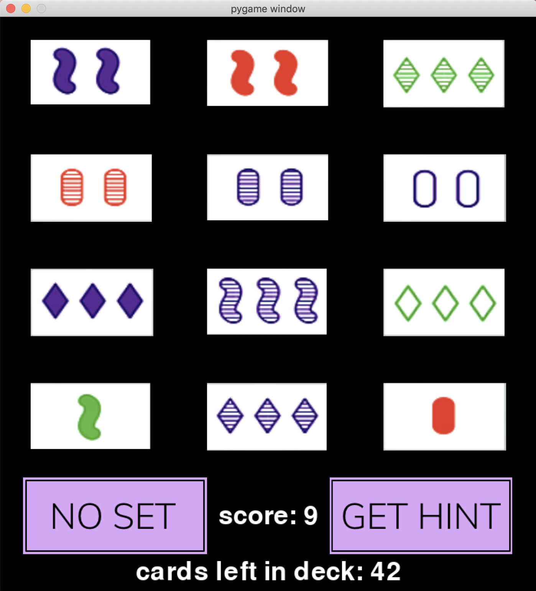

### After clicking the "no set" button:
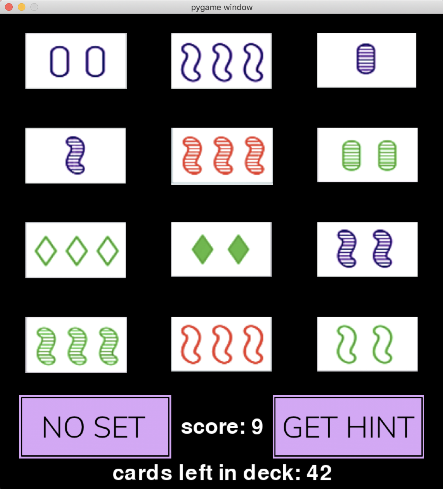

### Once you make it through the entire deck, you finish the game 
### A screen displaying "Game Over" and your final score is shown:
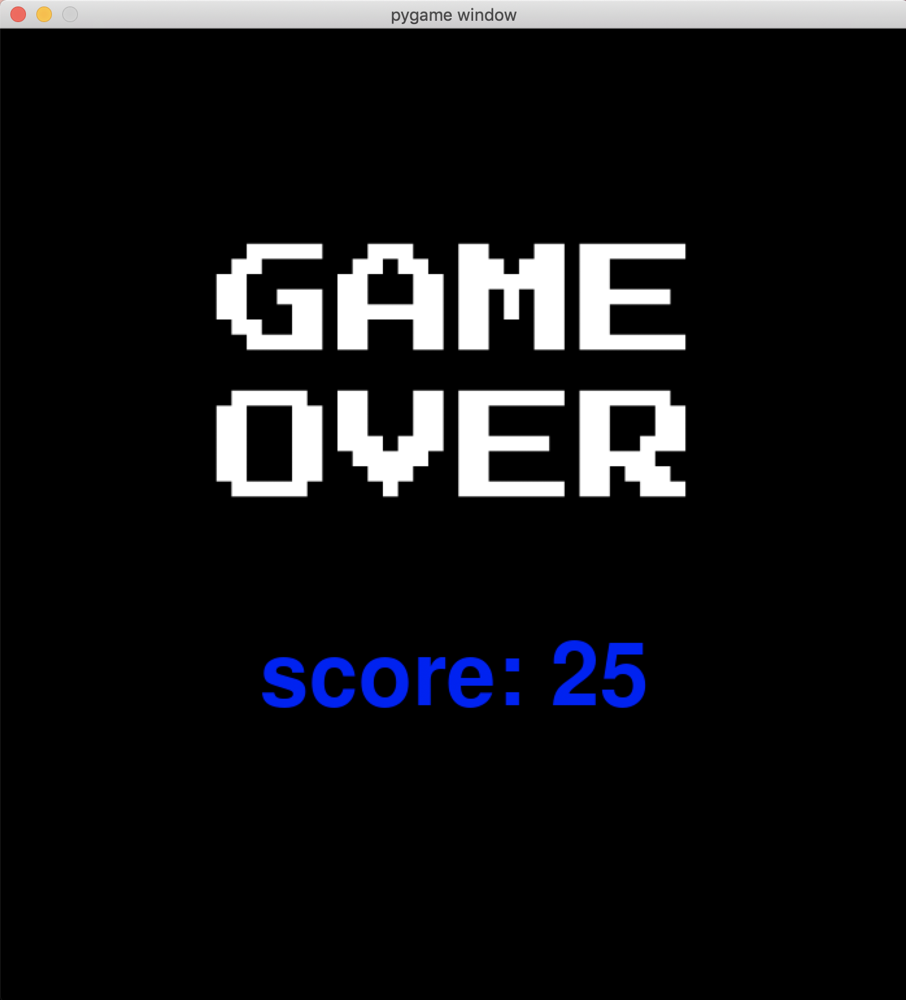

## If you decide to click "multiplayer" on the main screen instead of "single player," you get taken to this screen:
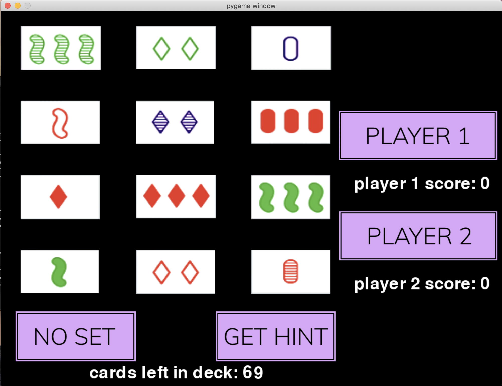

### The same rules apply for clicking cards, unclicking cards, and the "no set" and "get hint" buttons, but the game is now played with 2 players
### For a player to select a set, they need to click on the button identifying which player they are ("player 1" or "player 2") and then click on the 3 cards that they wish to select

### This screen displays player 1 selecting two cards:
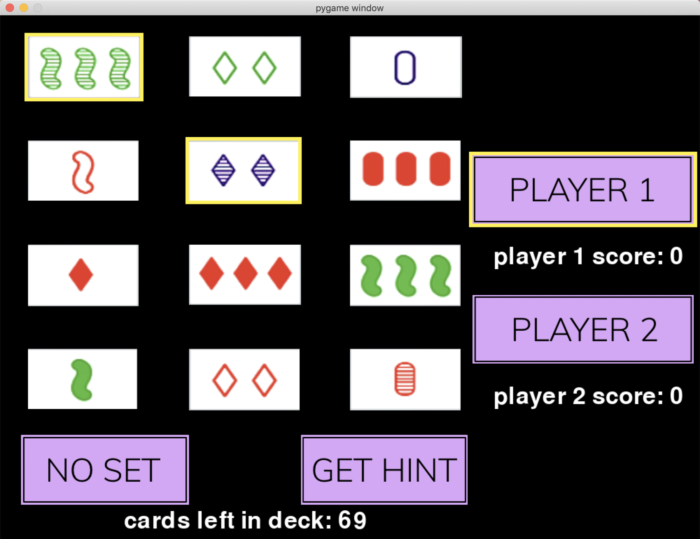

### When a player gets a set, they have a point added to their score:
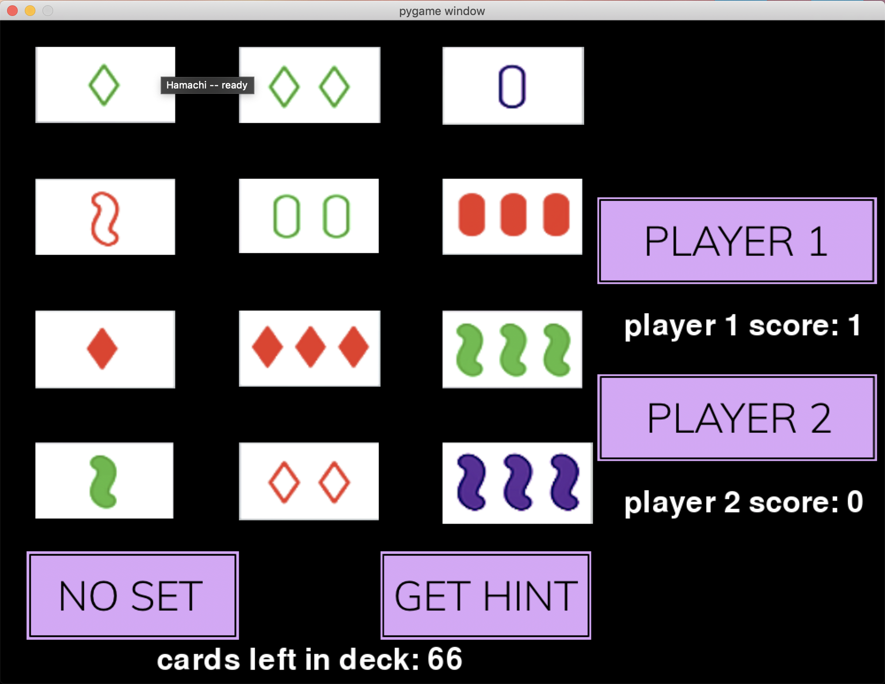

### Finally, when all of the cards in the deck have been used and there are no more sets, the end game screen is displayed, showing which player is the winner and how many points each player scored
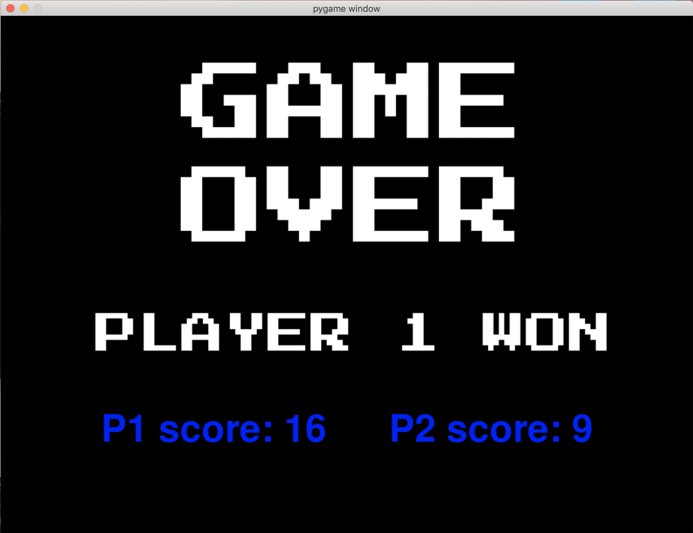

